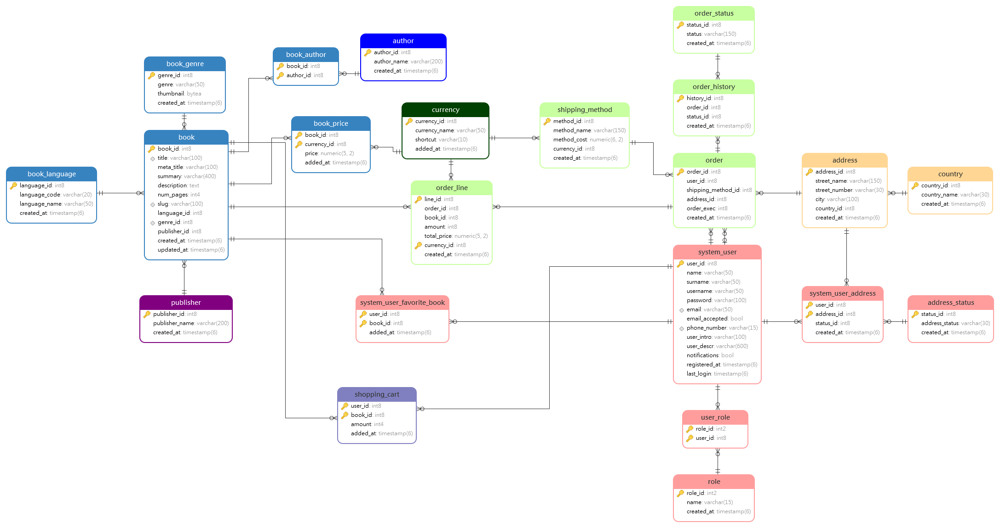
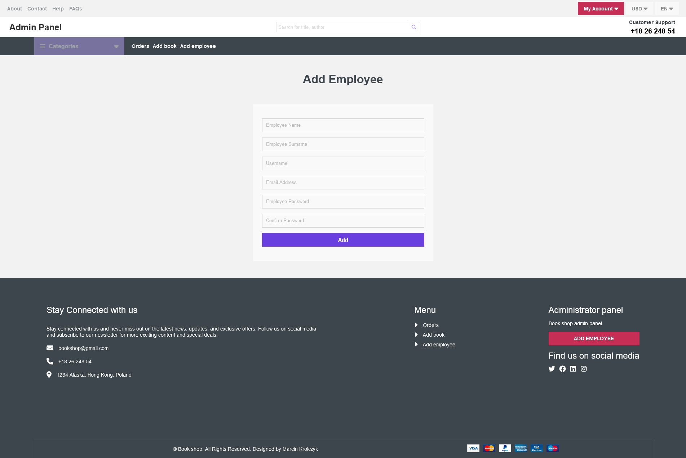

# Bookshop

The Bookshop is a web application dedicated to offering a wide range of books
to readers of all ages and interests. With a user-friendly interface and a vast collection of titles, the bookstore aims to provide a convenient and enjoyable shopping experience for book lovers.

## Table of Contents

- [Project Overview](#project-overview)
- [Features](#features)
- [Project Modules](#project-modules)
- [Technologies](#technologies)
- [Requirements](#requirements)
- [Getting Started](#getting-started)
- [Database Information](#database-information)
- [Usage](#usage)
- [Status](#status)
- [Contact](#contact)

## Project Overview

Bookshop is a comprehensive online bookstore that offers a wide range of books catering to all interests. 
With Bookshop, you can easily discover and purchase your favorite books, explore various genres, and stay updated with the latest releases.

## Features

- Responsive Design: Enjoy a seamless experience across devices, including desktops, tablets, and smartphones.
- Extensive Book Collection: Browse through a diverse selection of books, including fiction, non-fiction, bestsellers, classics, and more.
- Search and Filter: Easily search for books by title, author.
- Book Details: Get detailed information about each book in system database.
- User Accounts: Create a personal account to manage your orders, save favorite books, and collect items in your shopping cart.
- Favorite list:  Create a wishlist of books you wish to buy or read, making it easy to track and manage your reading goals.
- Top 10 Books Recommendation: Discover popular books and trending titles with the Top 10 Books recommendation feature.
- Recently Added Books: Stay updated with the latest additions to the Bookshop collection, ensuring you never miss out on new releases.
- User Roles: The system supports three user roles: Admin, Employee, and User, each with specific privileges and access levels.
- Shopping Cart: Easily add items to your cart and manage quantities. Remove or modify items before completing your purchase.
- Order Placement: Proceed from the cart to place your order.
- Multi-Currency Support: Complete your orders in your preferred currency.
- Order Fulfillment: Admin and Employee roles can manage order fulfillment, ensuring smooth processing and delivery.
- Assigning Employees to Orders: Admin can assign specific orders to staff members for efficient order management.
- Book Addition: Admins and Employees can add new books to the system, expanding the collection with ease.
- Staff Management: Admin can add new Employees to the system.
- Order Assignment: Staff members can take ownership of assigned orders.
- And more.

## Project Modules

```
.
├── doc                # contains the content for documentation of the project
├── infrastructure     # contains the infrastructure for the project
├── services           # Bookshop services (applications)
.
```

## Technologies

- HTML
- CSS
- JavaScript
- PHP
- NGINX
- Postgres DB
- Liquibase
- Docker & Docker Compose

## Requirements

- Git version control system
- Docker

## Getting Started

1. Go to 'infrastructure/local' directory and make own copy of '.env.sample.' file. Save it as '.env' in same place.
2. Set up POSTGRES_USER and POSTGRES_PASSWORD parameters inside .env file.
3. Go to 'services/bookshop' directory and make own copy of 'config.sample.php' file. Save it as 'config.php' in same place.
4. Set up the same USERNAME and PASSWORD inside 'config.php' as in step 2.
5. Go to 'infrastructure' folder and follow local environment start guide instructions.

## Database Information

The project uses the Liquibase library to manage the database.
Liquibase offers a user-friendly and secure approach to handling database creation,
management, and migration tasks. By maintaining the infrastructure as code, the project 
benefits from various advantages, including the ability to monitor and
control any modifications made to the database structure. The database schema itself
has been implemented using the XML format, ensuring a structured and organized foundation
for data and structure management. 

Database schemas and all database-dev related files can be found inside 'services/db' directory.

Entity Relationship (ERD) Diagram



## Usage

When project is running, open browser and navigate into http://localhost:8180/

### Usage examples

### Start Page


### Category page


### Contact


### Login page


### Register


### User dashboard


### Book detail


### User shopping cart


### Admin dashboard


### Admin add book


### Admin add Employee



### Employee dashboard


## Status

_completed_

## Contact
Created by @mkrolczykk - feel free to contact me!
* E-mail: m.krolczyk66@gmail.com

